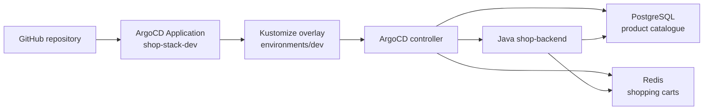

# ArgoCD GitOps Repository - Shop Application

This folder contains Kubernetes manifests and a Java Spring Boot backend for a shop application. PostgreSQL stores the product catalogue, while Redis stores shopping carts.

## Folder Structure

```text
ArgoCD/
├── app/                         # Java Spring Boot backend and Dockerfile
├── base/
│   ├── java-app.yaml            # Backend Deployment and Service
│   ├── postgres.yaml            # SQL product store
│   ├── redis.yaml               # NoSQL cart store
│   └── kustomization.yaml       # Base resources
├── environments/
│   ├── dev/kustomization.yaml   # shop-dev, two replicas, GHCR image
│   └── prod/kustomization.yaml  # shop-prod, three replicas
├── root-application.yaml        # ArgoCD Application
└── README.md
```

## System Architecture



This diagram maps the `app`, `base`, `environments`, and `root-application.yaml` files in this folder to the ArgoCD-managed resources.

## What Is in the Manifests

- `root-application.yaml` points ArgoCD to the DEV overlay and enables automated sync, pruning, and self-healing.
- `base/java-app.yaml` configures the Java image, PostgreSQL and Redis service names, credentials, health probes, and Service.
- `base/postgres.yaml` creates `shopdb`, `shopuser`, and the PostgreSQL Service.
- `base/redis.yaml` creates the Redis Deployment and Service.
- `environments/dev/kustomization.yaml` uses the public GHCR image and two backend replicas.
- `environments/prod/kustomization.yaml` defines the production overlay with three replicas.
- `app/` contains the Spring Boot products API backed by PostgreSQL and carts API backed by Redis.

## Initinal How to Use - Step by Step

### Step 1: Install ArgoCD

Run the commands from the repository root:

```bash
kubectl get namespace argocd >/dev/null 2>&1 || kubectl create namespace argocd
kubectl apply -n argocd -f https://raw.githubusercontent.com/argoproj/argo-cd/stable/manifests/install.yaml
kubectl rollout status deployment/argocd-server -n argocd --timeout=180s
kubectl get all -n argocd
```

### Step 2: Build and publish the backend image

```bash
docker build -t shop-backend:dev ArgoCD/app
docker tag shop-backend:dev ghcr.io/pchmielecki87/shop-backend:dev
docker push ghcr.io/pchmielecki87/shop-backend:dev
```

The GHCR package must be public, or the cluster must have an image pull Secret.

To verify if image is in place navigate to [https://github.com/pchmielecki87?tab=packages](https://github.com/pchmielecki87?tab=packages) or use CLI command:

```bash
docker buildx imagetools inspect ghcr.io/pchmielecki87/shop-backend:dev
```

### Step 3: Apply and inspect the ArgoCD Application

```bash
kubectl apply -f ArgoCD/root-application.yaml
kubectl get application shop-stack-dev -n argocd
kubectl get application shop-stack-dev -n argocd -w
```

Wait until the application reports `Synced` and `Healthy`, then verify the workloads:

```bash
kubectl get pods -n shop-dev
kubectl rollout status deployment/shop-backend -n shop-dev --timeout=180s
```

### Step 4: Test the API locally

Check the app health:

```bash
kubectl port-forward svc/shop-backend-service -n shop-dev 8080:8080
curl http://localhost:8080/actuator/health
curl http://localhost:8080/api/products
```

Add item to cart:

```bash
curl -X POST http://localhost:8080/api/carts/alice/items \
  -H 'Content-Type: application/json' \
  -d '{"productId":1,"quantity":2}'
```

Check cart (3 options):

```bash
curl -X GET http://localhost:8080/api/carts/alice
curl -s http://localhost:8080/api/carts/alice | jq .
kubectl exec -it deployment/redis -n shop-dev -- redis-cli HGETALL cart:alice
```

Delete item from cart:

```bash
curl -X DELETE http://localhost:8080/api/carts/alice
```

### Step 5: Log in to the ArgoCD Web UI

Get the initial admin password and forward the ArgoCD server port locally:

```bash
kubectl -n argocd get secret argocd-initial-admin-secret -o jsonpath="{.data.password}" | base64 -d
kubectl port-forward svc/argocd-server -n argocd 8088:443
```

Then open:

```text
https://localhost:8088
```

Login with:

```text
username: admin
password: <password-from-command-above>
```

> The browser may show a certificate warning because ArgoCD uses a self-signed certificate by default. Accept the warning and continue.

## Advanced usage - Step by Step

### Step 6: Simulate drift and confirm self-healing

Check the current desired state in Git:

```bash
kubectl get deployment shop-backend -n shop-dev -o jsonpath='{.spec.replicas}'
```

Manually change the live Deployment replica count to create drift:

```bash
kubectl scale deployment/shop-backend -n shop-dev --replicas=1
kubectl get application shop-stack-dev -n argocd
```

ArgoCD should detect the drift and restore the desired value from Git automatically. You can verify it with:

```bash
kubectl get deployment shop-backend -n shop-dev -o jsonpath='{.spec.replicas}'
kubectl get application shop-stack-dev -n argocd -o yaml | grep -E 'Status:|Health:|Operation'
```

Expected result: the replica count returns to the Git-defined value (for this repo: `2`), and the application status becomes `Synced` and `Healthy` again.

### Step 7: Practice prune behavior

This exercise shows how ArgoCD removes resources that no longer exist in Git when `prune: true` is enabled.

1. Add a temporary `ConfigMap` to the Git-managed manifests first, then apply it:

```bash
cat <<'EOF' > base/temp-prune-check.yaml
apiVersion: v1
kind: ConfigMap
metadata:
  name: temp-prune-check
  namespace: shop-dev
  labels:
    app: drift-demo
data:
  note: "This ConfigMap is managed by Git and should be pruned when removed from Git"
EOF
```

Update the base Kustomization to include the file:

```yaml
resources:
  - java-app.yaml
  - postgres.yaml
  - redis.yaml
  - temp-prune-check.yaml
```

Then sync:

```bash
kubectl apply -k environments/dev
kubectl get configmap -n shop-dev
kubectl get application shop-stack-dev -n argocd
```

2. Remove the file from Git and from the Kustomization, then trigger a sync:

```bash
rm base/temp-prune-check.yaml
```

And update `base/kustomization.yaml` to remove the entry from `resources`. Then push the changes to Git repo.

Then refresh ArgoCD:

```bash
kubectl get application shop-stack-dev -n argocd
kubectl get configmap -n shop-dev
```

Expected result: the temporary `ConfigMap` disappears because ArgoCD prunes resources no longer declared in Git.

3. Optional extension: compare with the `kubectl get application ... -o yaml` output and verify the `syncPolicy.automated.prune: true` setting from `root-application.yaml`.

### Step 8: Practice pre-sync validation

This exercise demonstrates a pre-sync hook: ArgoCD checks a condition before it applies the new desired state.

Create a small validation job that fails if the namespace is not healthy or the target service is unavailable:

```bash
cat <<'EOF' > /tmp/pre-sync-check.yaml
apiVersion: batch/v1
kind: Job
metadata:
  name: pre-sync-check
  namespace: shop-dev
spec:
  template:
    spec:
      restartPolicy: Never
      containers:
        - name: check
          image: busybox:1.36
          command: ["sh", "-c", "wget -q -O- http://shop-backend-service:8080/actuator/health || exit 1"]
EOF
kubectl apply -f /tmp/pre-sync-check.yaml
```

Then add a `preSync` hook in the Application or use a similar validation script in a separate GitOps pipeline. The key idea is:

- ArgoCD runs the pre-sync validation before applying changes.
- If the validation fails, synchronization stops.
- This is useful when you want to verify the app is healthy before a risky change is applied.

A good exercise is to temporarily break the service route or deliberately remove a required dependency and confirm that the sync is blocked until the validation succeeds again.

## Misc

### Use Cases

- Git-driven Kubernetes delivery with automated reconciliation.
- Self-healing after manual drift or pod deletion.
- A Java shop service using SQL for products and NoSQL for carts.
- Environment-specific scaling and image configuration with Kustomize.

### Limitations

Credentials are training values in manifests. PostgreSQL and Redis use Deployments without persistent volumes. The GHCR image must be public or referenced with an image pull Secret. `targetRevision: HEAD` follows the branch head, and automated pruning can delete resources removed from Git.

### Troubleshooting

```bash
kubectl get application shop-stack-dev -n argocd -o yaml
kubectl get events -n shop-dev --sort-by=.lastTimestamp
kubectl logs deployment/shop-backend -n shop-dev
kubectl rollout status deployment/shop-backend -n shop-dev
kubectl rollout restart deployment shop-backend -n shop-dev
```

For `ImagePullBackOff`, verify the GHCR package visibility and image tag. For `Progressing`, inspect probe failures and application logs. For `OutOfSync`, compare the ArgoCD revision with the GitHub branch.

See the detailed guide in [`docs/06-argocd.md`](../docs/06-argocd.md).
