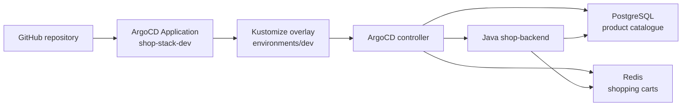

# ArgoCD GitOps Repository - Shop Application

This folder contains Kubernetes manifests and a Java Spring Boot backend for a shop application. PostgreSQL stores the product catalogue, while Redis stores shopping carts.

## Folder Structure

```text
ArgoCD/
├── app/                         # Java Spring Boot backend and Dockerfile
├── base/
│   ├── java-app.yaml            # Backend Deployment and Service
│   ├── postgres.yaml            # SQL product store
│   ├── redis.yaml               # NoSQL cart store
│   └── kustomization.yaml       # Base resources
├── environments/
│   ├── dev/kustomization.yaml   # shop-dev, two replicas, GHCR image
│   └── prod/kustomization.yaml  # shop-prod, three replicas
├── root-application.yaml        # ArgoCD Application
└── README.md
```

## System Architecture



This diagram maps the `app`, `base`, `environments`, and `root-application.yaml` files in this folder to the ArgoCD-managed resources.

## What Is in the Manifests

- `root-application.yaml` points ArgoCD to the DEV overlay and enables automated sync, pruning, and self-healing.
- `base/java-app.yaml` configures the Java image, PostgreSQL and Redis service names, credentials, health probes, and Service.
- `base/postgres.yaml` creates `shopdb`, `shopuser`, and the PostgreSQL Service.
- `base/redis.yaml` creates the Redis Deployment and Service.
- `environments/dev/kustomization.yaml` uses the public GHCR image and two backend replicas.
- `environments/prod/kustomization.yaml` defines the production overlay with three replicas.
- `app/` contains the Spring Boot products API backed by PostgreSQL and carts API backed by Redis.

## Initinal Config and App Management

### 1: Install ArgoCD

Run the commands from the repository root:

```bash
kubectl get namespace argocd >/dev/null 2>&1 || kubectl create namespace argocd
kubectl apply -n argocd -f https://raw.githubusercontent.com/argoproj/argo-cd/stable/manifests/install.yaml
kubectl rollout status deployment/argocd-server -n argocd --timeout=180s
kubectl get all -n argocd
```

### 2: Build and publish the backend image

```bash
docker build -t shop-backend:dev ArgoCD/app
docker tag shop-backend:dev ghcr.io/pchmielecki87/shop-backend:dev
docker push ghcr.io/pchmielecki87/shop-backend:dev
```

The GHCR package must be public, or the cluster must have an image pull Secret.

To verify if image is in place navigate to [https://github.com/pchmielecki87?tab=packages](https://github.com/pchmielecki87?tab=packages) or use CLI command:

```bash
docker buildx imagetools inspect ghcr.io/pchmielecki87/shop-backend:dev
```

### 3: Apply and inspect the ArgoCD Application

```bash
kubectl apply -f ArgoCD/root-application.yaml
kubectl get application shop-stack-dev -n argocd
kubectl get application shop-stack-dev -n argocd -w
```

Wait until the application reports `Synced` and `Healthy`, then verify the workloads:

```bash
kubectl get pods -n shop-dev
kubectl rollout status deployment/shop-backend -n shop-dev --timeout=180s
```

### 4: Test the API locally

Check the app health:

```bash
kubectl port-forward svc/shop-backend-service -n shop-dev 8080:8080
curl http://localhost:8080/actuator/health
curl http://localhost:8080/api/products
```

Add item to cart:

```bash
curl -X POST http://localhost:8080/api/carts/alice/items \
  -H 'Content-Type: application/json' \
  -d '{"productId":1,"quantity":2}'
```

Check cart (3 options):

```bash
curl -X GET http://localhost:8080/api/carts/alice
curl -s http://localhost:8080/api/carts/alice | jq .
kubectl exec -it deployment/redis -n shop-dev -- redis-cli HGETALL cart:alice
```

Delete item from cart:

```bash
curl -X DELETE http://localhost:8080/api/carts/alice
```

### 5: Log in to the ArgoCD Web UI

Get the initial admin password and forward the ArgoCD server port locally:

```bash
kubectl -n argocd get secret argocd-initial-admin-secret -o jsonpath="{.data.password}" | base64 -d
kubectl port-forward svc/argocd-server -n argocd 8088:443
```

Then open:

```text
https://localhost:8088
```

Login with:

```text
username: admin
password: <password-from-command-above>
```

> The browser may show a certificate warning because ArgoCD uses a self-signed certificate by default. Accept the warning and continue.

## Automation and Hooks

### 6: Simulate drift and confirm self-healing

Check the current desired state in Git:

```bash
kubectl get deployment shop-backend -n shop-dev -o jsonpath='{.spec.replicas}'
```

Manually change the live Deployment replica count to create drift:

```bash
kubectl scale deployment/shop-backend -n shop-dev --replicas=1
kubectl get application shop-stack-dev -n argocd
```

ArgoCD should detect the drift and restore the desired value from Git automatically. You can verify it with:

```bash
kubectl get deployment shop-backend -n shop-dev -o jsonpath='{.spec.replicas}'
kubectl get application shop-stack-dev -n argocd -o yaml | grep -E 'Status:|Health:|Operation'
```

Expected result: the replica count returns to the Git-defined value (for this repo: `2`), and the application status becomes `Synced` and `Healthy` again.

### 7: Practice prune behavior

This exercise shows how ArgoCD removes resources that no longer exist in Git when `prune: true` is enabled.

1. Add a temporary `ConfigMap` to the Git-managed manifests first, then apply it:

```bash
cat <<'EOF' > base/temp-prune-check.yaml
apiVersion: v1
kind: ConfigMap
metadata:
  name: temp-prune-check
  namespace: shop-dev
  labels:
    app: drift-demo
data:
  note: "This ConfigMap is managed by Git and should be pruned when removed from Git"
EOF
```

Update the base Kustomization to include the file:

```yaml
resources:
  - java-app.yaml
  - postgres.yaml
  - redis.yaml
  - temp-prune-check.yaml
```

Then sync:

```bash
kubectl apply -k environments/dev
kubectl get configmap -n shop-dev
kubectl get application shop-stack-dev -n argocd
```

2. Remove the file from Git and from the Kustomization, then trigger a sync:

```bash
rm base/temp-prune-check.yaml
```

And update `base/kustomization.yaml` to remove the entry from `resources`. Then push the changes to Git repo.

Then refresh ArgoCD:

```bash
kubectl get application shop-stack-dev -n argocd
kubectl get configmap -n shop-dev
```

Expected result: the temporary `ConfigMap` disappears because ArgoCD prunes resources no longer declared in Git.

3. Optional extension: compare with the `kubectl get application ... -o yaml` output and verify the `syncPolicy.automated.prune: true` setting from `root-application.yaml`.

### 8: Practice ArgoCD PreSync Hooks (Database Migration Job)

This exercise demonstrates how ArgoCD uses **Resource Hooks** to run a database migration `Job` during the `PreSync` phase—executing and verifying it before sync applies the main application resources (`Deployment`).

1. Add a PreSync `Job` manifest for the database migration:

```bash
cat <<'EOF' > base/db-migration-job.yaml
apiVersion: batch/v1
kind: Job
metadata:
  name: db-migration-job
  annotations:
    argocd.argoproj.io/hook: PreSync
    argocd.argoproj.io/hook-delete-policy: HookSucceeded
spec:
  template:
    spec:
      containers:
      - name: db-migrator
        image: postgres:15-alpine
        command: ["sh", "-c", "echo 'Running PreSync DB Schema Migration...' && sleep 5"]
      restartPolicy: Never
  backoffLimit: 1
EOF
```

Update the base Kustomization to include the migration job:

```yaml
resources:
  - java-app.yaml
  - postgres.yaml
  - redis.yaml
  - db-migration-job.yaml
```

Commit and push the changes to your Git repository. Trigger a sync and observe the execution order in ArgoCD:

```bash
kubectl get pods -n shop-dev -w
```

Expected result: ArgoCD first creates and waits for db-migration-job to complete successfully during the PreSync phase. Only after the job finishes will ArgoCD proceed to synchronize the main application stack (shop-backend, postgres, redis). Once finished, the job pod is automatically cleaned up per the HookSucceeded delete policy.

## IAM

### 8: Create developer user and RBAC permissions

In enterprise cloud environments (AWS EKS or Azure AKS), ArgoCD integrates directly with IAM (via AWS IAM Identity Center) or Entra ID (Azure AD) using OpenID Connect (OIDC). On Docker Desktop, we simulate this workflow using ArgoCD's built-in RBAC engine with local users or mock Dex OIDC tokens.

1. Enable local user management in ArgoCD by editing the `argocd-cm` ConfigMap:

```bash
kubectl patch configmap argocd-cm -n argocd --type merge -p '{"data":{"accounts.developer":"apiKey, login", "accounts.developer.enabled":"true"}}'
```

2. Assign a read-only RBAC policy for the developer user in the argocd-rbac-cm ConfigMap:

```bash
kubectl patch configmap argocd-rbac-cm -n argocd --type merge -p '{"data":{"policy.csv":"p, role:dev-readonly, applications, get, shop-dev/*, allow\np, role:dev-readonly, applications, sync, shop-dev/*, deny\ng, developer, role:dev-readonly"}}'
```

Set a password for the newly created developer user:

```bash
HASH=$(docker run --rm caddy caddy hash-password --plaintext 'DeveloperPass123')
kubectl patch secret argocd-secret -n argocd --type merge -p "{\"stringData\": {\"accounts.developer.password\": \"$HASH\", \"accounts.developer.mtime\": \"$(date -u +%Y-%m-%dT%H:%M:%SZ)\"}}"
```

Optionally restart might be needed:

```bash
kubectl rollout restart deployment argocd-server -n argocd
kubectl rollout status deployment argocd-server -n argocd
```

Then re-enable ArgoCD UI after restart:

```bash
kubectl port-forward svc/argocd-server -n argocd 8088:443
```

3. Log in to ArgoCD UI:

- Open http://localhost:8088 in your browser.
- Log out from the admin account.
- Log in with credentials:
- Username: developer
- Password: DeveloperPass123

Expected result: Authentication succeeds, and the top right panel shows you are logged in as developer.

NOTE: As developer you cannot see any applications. Update RBAC role to be able to see it:

```bash
kubectl patch configmap argocd-rbac-cm -n argocd --type merge -p '{"data":{"policy.csv":"p, role:dev-readonly, applications, get, */*, allow\np, role:dev-readonly, applications, sync, */*, deny\np, role:dev-readonly, projects, get, *, allow\ng, developer, role:dev-readonly"}}'
```

### 10: Test Unauthorized Actions & Policy Enforcement

Verify that RBAC policies actively block restricted operations (such as manual triggers or synchronization) in the ArgoCD Web UI for non-admin roles.

View the application status in the Web UI (Allowed action):

- Click on the shop-stack-dev application tile.
- Expected result: You can successfully view application topology, resources, tree view, and live status (Synced / Healthy).

Attempt to trigger a manual sync via the UI (Forbidden action):

- Click the SYNC button at the top menu.
- Click SYNCHRONIZE.
- Expected result: The UI blocks the action and displays an error notification banner:
- PermissionDenied: permission denied: applications, sync, shop-dev/shop-stack-dev, deny

Note on Enterprise IAM Mapping (AWS / Azure):

- AWS IAM: OIDC claims map AWS SSO / IAM Identity Center groups (arn:aws:iam::123456789012:role/DeveloperRole) directly to role:dev-readonly in policy.csv.
- Azure Entra ID: Azure App Registration security group Object IDs (g, 90f0d111-2222-3333-4444-555555555555, role:dev-readonly) are matched in argocd-rbac-cm.

### 11: Inspect Audit Logs and Security Events

Audit and track changes, authorization failures, and administrative actions in ArgoCD.
Stream ArgoCD API Server logs to inspect denied access requests:

```bash
kubectl logs -n argocd -l app.kubernetes.io/name=argocd-server --tail=50 | grep -i "permission denied"
```

Expected result: Locate the audit entry generated by Step 16, detailing the timestamp, user (developer), requested action (sync), and denial reason.

Inspect Kubernetes Audit / Event log entries for unauthorized cluster-level activity in the target namespace:

```bash
kubectl get events -n shop-dev --sort-by='.lastTimestamp'
```

Verify application history and revision audits directly via ArgoCD:

```bash
kubectl get application shop-stack-dev -n argocd -o jsonpath='{range .status.history[*]}{"Revision: "}{.revision}{" | DeployedAt: "}{.deployedAt}{"\n"}{end}'
```

Expected result: Displays a complete audit trail of past synchronizations, including the commit SHA, timestamp, and author for every deployment in the GitOps pipeline.

## Monitoring & Troubleshooting

### Prerequisites: Quick Prometheus & Grafana Setup (Docker Desktop)

Install the Prometheus & Grafana monitoring stack via Helm optimized for Docker Desktop resource limits.

1. Add the Helm repository and install `kube-prometheus-stack`:

```bash
helm repo add prometheus-community https://prometheus-community.github.io/helm-charts
helm repo update

helm install monitoring prometheus-community/kube-prometheus-stack \
  --namespace monitoring \
  --create-namespace \
  --set alertmanager.enabled=false \
  --set prometheus.prometheusSpec.resources.requests.memory=256Mi \
  --set prometheus.prometheusSpec.resources.limits.memory=512Mi
```

Decode secret:

```bash
kubectl get secret --namespace monitoring monitoring-grafana -o jsonpath="{.data.admin-password}" | base64 --decode ; echo
```

Access the Grafana Dashboard locally:

```bash
kubectl port-forward svc/monitoring-grafana 3000:80 -n monitoring
```

URL: http://localhost:3000
Username: admin
Password: generated secret

### 12: Trigger an Deployment Failure via Git

Simulate a failed deployment scenario by introducing an invalid container image tag into your Git repository so ArgoCD treats it as the desired state.
Modify the backend image tag in your Kustomize overlay (environments/dev/kustomization.yaml):

```yaml
images:
  - name: wiremock/wiremock
    newName: wiremock/wiremock
    newTag: dev-does-not-exist
```

Commit and push the broken configuration to Git:

```bash
git add environments/dev/kustomization.yaml
git commit -m "lab: invalid backend tag"
git push origin main
```

Observe the deployment status in your local cluster:

```bash
kubectl get application shop-stack-dev -n argocd -w
kubectl get pods -n shop-dev -w
```

Expected result: The Application state in ArgoCD transitions away from Healthy, and the newly created backend Pod fails to reach the Ready state.

### 13: Diagnose the Root Cause

Perform a structured root-cause analysis by inspecting ArgoCD, the Deployment status, and the Pod events to locate the issue.
Inspect the overall application health in ArgoCD:

```bash
kubectl describe application shop-stack-dev -n argocd
```

Expected result: Look for Degraded or Progressing health statuses, sync condition errors, or failed operations.
Check the Deployment rollout status and list running Pods:

```bash
kubectl rollout status deploy/shop-backend -n shop-dev --timeout=60s
kubectl get pods -n shop-dev
```

Expected result: The rollout exceeds the timeout threshold, and the new Pod shows an ImagePullBackOff or ErrImagePull status.

Stream application container logs to verify if the process fails at startup or fails to pull:

```bash
kubectl logs -l app=shop-backend -n shop-dev --all-containers --tail=50
```

Inspect Kubernetes events to confirm the exact failure reason:

```bash
kubectl describe pod -l app=shop-backend -n shop-dev
kubectl get events -n shop-dev --sort-by='.lastTimestamp'
```

Inspect node-level system journal / container daemon logs (simulated on Docker Desktop node via kubectl node-shell or debug pod):

```bash
# 1. Create debug pod in background
NODE_NAME=$(kubectl get nodes -o jsonpath='{.items[0].metadata.name}')
kubectl debug node/$NODE_NAME -n default --image=alpine --profile=sysadmin -it -- chroot /host journalctl -u containerd -n 50

# 2. Read logs from created pod
kubectl logs pod/node-debugger-desktop-control-plane-<number> -n default

# 3. Cleanup after debugging
kubectl get pods -n default | node-debugger
kubectl delete pod node-debugger-<xyz> -n default
```

Expected result:

- kubectl events confirms a Failed / PullImage event stating that the image tag wiremock/wiremock:dev-does-not-exist was not found.
- journalctl / node logs confirm container pull failures at the runtime layer (containerd).

### 14: Repair and Verify Service Recovery

Fix the desired state in Git using GitOps practices (do not edit the Deployment directly using kubectl). Auto-sync will deploy the corrected revision and recover the service.
Revert the breaking commit in Git (or fix the tag manually in kustomization.yaml):

```bash
git revert HEAD --no-edit
git push origin main
```

Wait for ArgoCD to detect the fix and complete the rollout:

```bash
kubectl rollout status deploy/shop-backend -n shop-dev
```

Expected result: ArgoCD status returns to Synced and Healthy, with the rollout successfully completed.
Verify service health in ArgoCD UI portal. Expected result: All Pods display 1/1 Running.

## Misc

### Use Cases

- Git-driven Kubernetes delivery with automated reconciliation.
- Self-healing after manual drift or pod deletion.
- A Java shop service using SQL for products and NoSQL for carts.
- Environment-specific scaling and image configuration with Kustomize.

### Limitations

Credentials are training values in manifests. PostgreSQL and Redis use Deployments without persistent volumes. The GHCR image must be public or referenced with an image pull Secret. `targetRevision: HEAD` follows the branch head, and automated pruning can delete resources removed from Git.

### Troubleshooting

```bash
kubectl get application shop-stack-dev -n argocd -o yaml
kubectl get events -n shop-dev --sort-by=.lastTimestamp
kubectl logs deployment/shop-backend -n shop-dev
kubectl rollout status deployment/shop-backend -n shop-dev
kubectl rollout restart deployment shop-backend -n shop-dev
```

For `ImagePullBackOff`, verify the GHCR package visibility and image tag. For `Progressing`, inspect probe failures and application logs. For `OutOfSync`, compare the ArgoCD revision with the GitHub branch.

See the detailed guide in [`docs/06-argocd.md`](../docs/06-argocd.md).
