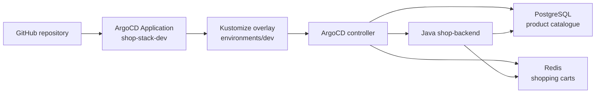

# ArgoCD GitOps Repository - Shop Application

This folder contains Kubernetes manifests and a Java Spring Boot backend for a shop application. PostgreSQL stores the product catalogue, while Redis stores shopping carts.

## Folder Structure

```text
ArgoCD/
├── app/                         # Java Spring Boot backend and Dockerfile
├── base/
│   ├── java-app.yaml            # Backend Deployment and Service
│   ├── postgres.yaml            # SQL product store
│   ├── redis.yaml               # NoSQL cart store
│   └── kustomization.yaml       # Base resources
├── environments/
│   ├── dev/kustomization.yaml   # shop-dev, two replicas, GHCR image
│   └── prod/kustomization.yaml  # shop-prod, three replicas
├── root-application.yaml        # ArgoCD Application
└── README.md
```

## Technical Architecture



This diagram maps the `app`, `base`, `environments`, and `root-application.yaml` files in this folder to the ArgoCD-managed resources.

## What Is in the Manifests

- `root-application.yaml` points ArgoCD to the DEV overlay and enables automated sync, pruning, and self-healing.
- `base/java-app.yaml` configures the Java image, PostgreSQL and Redis service names, credentials, health probes, and Service.
- `base/postgres.yaml` creates `shopdb`, `shopuser`, and the PostgreSQL Service.
- `base/redis.yaml` creates the Redis Deployment and Service.
- `environments/dev/kustomization.yaml` uses the public GHCR image and two backend replicas.
- `environments/prod/kustomization.yaml` defines the production overlay with three replicas.
- `app/` contains the Spring Boot products API backed by PostgreSQL and carts API backed by Redis.

## How to Use - Step by Step

### Step 1: Install ArgoCD

Run the commands from the repository root:

```bash
kubectl get namespace argocd >/dev/null 2>&1 || kubectl create namespace argocd
kubectl apply -n argocd -f https://raw.githubusercontent.com/argoproj/argo-cd/stable/manifests/install.yaml
kubectl rollout status deployment/argocd-server -n argocd --timeout=180s
```

### Step 2: Build and publish the backend image

```bash
docker build -t shop-backend:dev ArgoCD/app
docker tag shop-backend:dev ghcr.io/pchmielecki87/shop-backend:dev
docker push ghcr.io/pchmielecki87/shop-backend:dev
```

The GHCR package must be public, or the cluster must have an image pull Secret.

### Step 3: Apply and inspect the ArgoCD Application

```bash
kubectl apply -f ArgoCD/root-application.yaml
kubectl get application shop-stack-dev -n argocd
kubectl get application shop-stack-dev -n argocd -w
```

Wait until the application reports `Synced` and `Healthy`, then verify the workloads:

```bash
kubectl get pods -n shop-dev
kubectl rollout status deployment/shop-backend -n shop-dev --timeout=180s
```

### Step 4: Test the API locally

```bash
kubectl port-forward svc/shop-backend-service -n shop-dev 8080:8080
curl http://localhost:8080/actuator/health
curl http://localhost:8080/api/products
curl -X POST http://localhost:8080/api/carts/alice/items \
  -H 'Content-Type: application/json' \
  -d '{"productId":1,"quantity":2}'
```

## Use Cases

- Git-driven Kubernetes delivery with automated reconciliation.
- Self-healing after manual drift or pod deletion.
- A Java shop service using SQL for products and NoSQL for carts.
- Environment-specific scaling and image configuration with Kustomize.

## Limitations

Credentials are training values in manifests. PostgreSQL and Redis use Deployments without persistent volumes. The GHCR image must be public or referenced with an image pull Secret. `targetRevision: HEAD` follows the branch head, and automated pruning can delete resources removed from Git.

## Troubleshooting

```bash
kubectl get application shop-stack-dev -n argocd -o yaml
kubectl get events -n shop-dev --sort-by=.lastTimestamp
kubectl logs deployment/shop-backend -n shop-dev
kubectl rollout status deployment/shop-backend -n shop-dev
kubectl rollout restart deployment shop-backend -n shop-dev
```

For `ImagePullBackOff`, verify the GHCR package visibility and image tag. For `Progressing`, inspect probe failures and application logs. For `OutOfSync`, compare the ArgoCD revision with the GitHub branch.

See the detailed guide in [`docs/06-argocd.md`](../docs/06-argocd.md).
