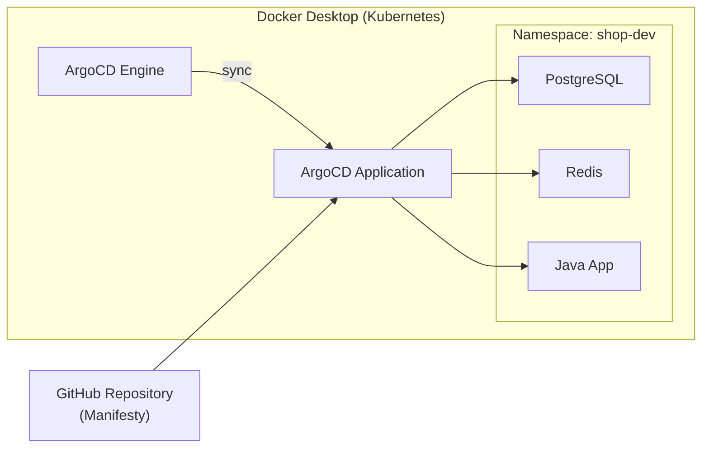
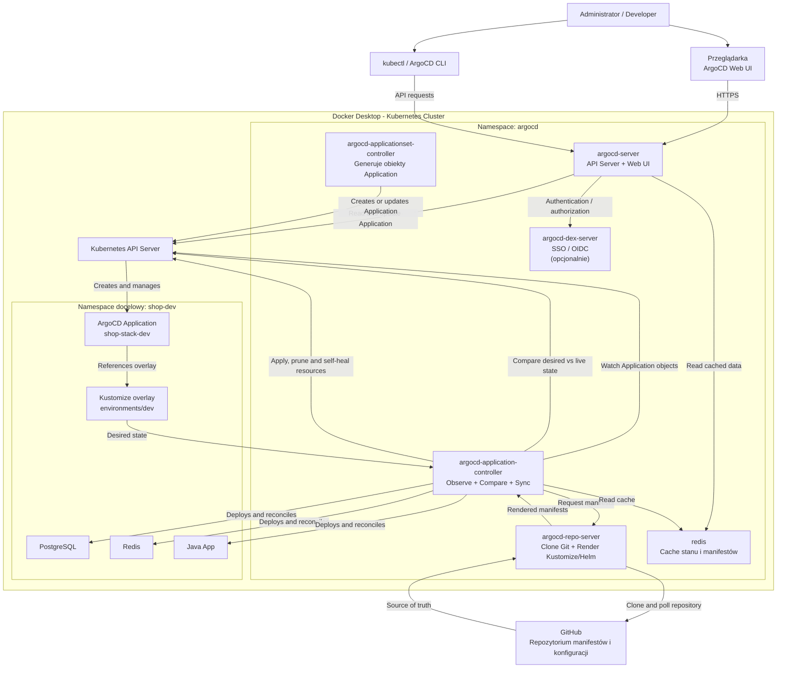

# ArgoCD GitOps Repository – Shop Application

Repozytorium manifestów Kubernetes i konfiguracji ArgoCD dla mikrousługi w Javie z bazami danych PostgreSQL (SQL) i Redis (NoSQL).

## 📁 Struktura Katalogów

```text
ArgoCD/
├── base/                         # Bazowe manifesty Kubernetes
│   ├── java-app.yaml             # Deployment i Service dla mikroserwisu Java
│   ├── postgres.yaml             # Baza danych SQL (Katalog produktów)
│   ├── redis.yaml                # Baza danych NoSQL (Koszyk sklepowy)
│   └── kustomization.yaml        # Konfiguracja Kustomize dla pliku base
├── environments/                 # Konfiguracje dla poszczególnych środowisk
│   ├── dev/
│   │   └── kustomization.yaml    # Nadpisanie parametrów dla środowiska DEV
│   └── prod/
│       └── kustomization.yaml    # Nadpisanie parametrów dla środowiska PROD
├── root-application.yaml         # Deklaratywny plik aplikacji ArgoCD (App-of-Apps)
└── README.md                     # Dokumentacja
```


## 🏗️ Architektura Środowiska



## 🛠️ Przewodnik Wdrożenia Lokalnego — Krok po Kroku

### Krok 1: Weryfikacja środowiska Kubernetes
Upewnij się, że Docker Desktop ma włączoną obsługę Kubernetes, a Twój lokalny kontekst jest ustawiony prawidłowo:
```bash
kubectl config current-context
# Oczekiwany wynik: docker-desktop
```

### Krok 2: Instalacja ArgoCD w klastrze

Utwórz dedykowaną przestrzeń nazw (namespace) i zainstaluj w niej komponenty serwera ArgoCD:

```bash
kubectl create namespace argocd
kubectl apply -n argocd -f https://raw.githubusercontent.com/argoproj/argo-cd/stable/manifests/install.yaml
```

Odczekaj chwilę, aż wszystkie pody osiągną stan Running:

```bash
kubectl get pods -n argocd --watch
```

Po wdrożeniu architektura ArgoCD wygląda następująco:



### Krok 3: Zbudowanie obrazu aplikacji Java

Aplikacja backendowa znajduje się w katalogu `ArgoCD/app`. Zbuduj obraz przed wdrożeniem manifestów:

```bash
docker build -t shop-backend:dev ArgoCD/app
```

W konfiguracji DEV używany jest obraz `shop-backend:dev` z lokalnego Docker Desktop. Jeśli klaster nie korzysta z lokalnego magazynu obrazów, wypchnij obraz do registry dostępnym dla węzłów Kubernetes i zmień `newName` w pliku `ArgoCD/environments/dev/kustomization.yaml`.

Backend udostępnia następujące endpointy:

- `GET /api/products` - odczyt produktów z PostgreSQL,
- `POST /api/products` - dodanie produktu do PostgreSQL,
- `GET /api/carts/{cartId}` - odczyt koszyka z Redis,
- `POST /api/carts/{cartId}/items` - dodanie produktu do koszyka w Redis,
- `DELETE /api/carts/{cartId}` - wyczyszczenie koszyka,
- `GET /actuator/health` - status zdrowia aplikacji.

### Krok 5: Aktualizacja adresu repozytorium

Podmień adres w pliku ArgoCD/root-application.yaml, aby wskazywał na Twoje repozytorium GitHub:

```yaml
spec:
  source:
    repoURL: 'https://github.com/pchmielecki87/HelmKubernetesWorkshop.git'
```

Zapisz plik i wypchnij zmianę do Git:

```bash
git add ArgoCD/root-application.yaml
git commit -m "fix: aktualizacja repoURL"
git push
```

### Krok 6: Rejestracja aplikacji w ArgoCD

Przekaż zarządzanie stosem aplikacji do ArgoCD za pomocą głównego manifestu:

```bash
kubectl apply -f ArgoCD/root-application.yaml
```

### Krok 7: Dostęp do panelu ArgoCD (Web UI)

Przekieruj port panelu administracyjnego na swój komputer:

```bash
kubectl port-forward svc/argocd-server -n argocd 8080:443
```

Otwórz nowy terminal i pobierz wygenerowane domyślne hasło dla konta admin:

```bash
kubectl -n argocd get secret argocd-initial-admin-secret -o jsonpath="{.data.password}" | base64 -d && echo
```

Otwórz w przeglądarce adres https://localhost:8080 (zaakceptuj ostrzeżenie o certyfikacie SSL).

Zaloguj się danymi:

- **Login:** `admin`
- **Hasło:** hasło wygenerowane w kroku 2
### Krok 8: Weryfikacja stanu i testy GitOps

#### 1. Weryfikacja wdrożenia

W panelu ArgoCD aplikacja shop-stack-dev powinna mieć status Synced oraz Healthy.

Sprawdź uruchomione zasoby w przestrzeni shop-dev:

```bash
kubectl get all -n shop-dev
```

#### 2. Test automatycznej synchronizacji (Auto-Sync)

1. Otwórz plik `ArgoCD/environments/dev/kustomization.yaml`.
2. Zmień liczbę replik backendu z 2 na 3.
3. Zcommituj i wypchnij zmianę:

  ```bash
git commit -am "chore: zmiana liczby replik na 3"
git push
  ```

4. Obserwuj w panelu ArgoCD, jak bez wpisywania komend `kubectl` automatycznie tworzy się trzeci pod.

#### 3. Test samoleczenia (Self-Healing)

Ręcznie skasuj pod z klastra:

```bash
kubectl delete pod -l app=shop-backend -n shop-dev
```

ArgoCD w ciągu kilku sekund wykryje różnicę ze stanem w Git i automatycznie go odtworzy.

## Troubleshooting

### Restart wdrożenia backendu

Jeśli `shop-backend` nie odpowiada albo wdrożenie utknęło, zrestartuj deployment:

```bash
kubectl rollout restart deployment shop-backend -n shop-dev
```

Poczekaj na zakończenie procesu wdrażania:

```bash
kubectl rollout status deployment/shop-backend -n shop-dev
```

Sprawdź stan deploymentu i jego podów:

```bash
kubectl get deployment shop-backend -n shop-dev
kubectl get pods -n shop-dev -l app=shop-backend
```

Jeśli problem nadal występuje, sprawdź logi, opis poda oraz ostatnie zdarzenia w namespace:

```bash
kubectl logs deployment/shop-backend -n shop-dev
kubectl describe pod -l app=shop-backend -n shop-dev
kubectl get events -n shop-dev --sort-by=.lastTimestamp
```

Jeśli widzisz `ImagePullBackOff` albo `ErrImagePull`, Kubernetes nie ma dostępu do obrazu `shop-backend:dev`. Zbuduj obraz ponownie w Docker Desktop:

```bash
docker build -t shop-backend:dev ArgoCD/app
```

Jeśli węzeł Kubernetes używa osobnego magazynu obrazów, wypchnij obraz do registry dostępnego dla klastra, a następnie ustaw jego adres w `ArgoCD/environments/dev/kustomization.yaml`:

```yaml
images:
  - name: shop-backend
    newName: registry.example.com/shop-backend
    newTag: dev
```

Po zmianie obrazu zastosuj manifesty ponownie:

```bash
kubectl apply -k ArgoCD/environments/dev
kubectl rollout status deployment/shop-backend -n shop-dev
```

Po restarcie ArgoCD może przez chwilę pokazywać status `Progressing`. Po zakończeniu rollout'u aplikacja powinna wrócić do stanu `Synced` i `Healthy`.