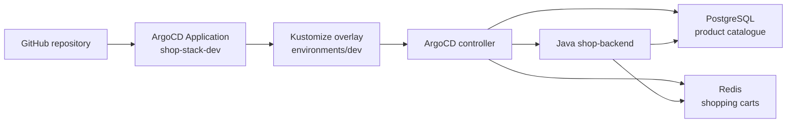

# ArgoCD GitOps Repository - Shop Application

This folder contains Kubernetes manifests and a Java Spring Boot backend for a shop application. PostgreSQL stores the product catalogue, while Redis stores shopping carts.

## Folder Structure

```text
ArgoCD/
├── app/                         # Java Spring Boot backend and Dockerfile
├── base/
│   ├── java-app.yaml            # Backend Deployment and Service
│   ├── postgres.yaml            # SQL product store
│   ├── redis.yaml               # NoSQL cart store
│   └── kustomization.yaml       # Base resources
├── environments/
│   ├── dev/kustomization.yaml   # shop-dev, two replicas, GHCR image
│   └── prod/kustomization.yaml  # shop-prod, three replicas
├── root-application.yaml        # ArgoCD Application
└── README.md
```

## System Architecture



This diagram maps the `app`, `base`, `environments`, and `root-application.yaml` files in this folder to the ArgoCD-managed resources.

## What Is in the Manifests

- `root-application.yaml` points ArgoCD to the DEV overlay and enables automated sync, pruning, and self-healing.
- `base/java-app.yaml` configures the Java image, PostgreSQL and Redis service names, credentials, health probes, and Service.
- `base/postgres.yaml` creates `shopdb`, `shopuser`, and the PostgreSQL Service.
- `base/redis.yaml` creates the Redis Deployment and Service.
- `environments/dev/kustomization.yaml` uses the public GHCR image and two backend replicas.
- `environments/prod/kustomization.yaml` defines the production overlay with three replicas.
- `app/` contains the Spring Boot products API backed by PostgreSQL and carts API backed by Redis.
