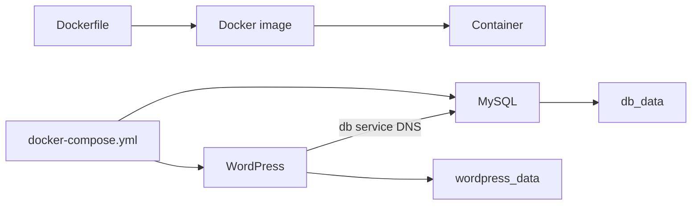

# Docker Workshop

This folder contains Docker fundamentals and a local WordPress stack.

## Folder Structure

```text
Docker/
├── Dockerfile
├── docker-compose.yml
├── Readme_Docker.md
├── Readme_Docker_Compose.md
├── C#.NET_Core8_Blazor_WebAssembly/
├── create_mvc_structure.sh
└── README.md
```

## Technical Overview

The root `Dockerfile` builds an Alpine image with `vim` and a marker file. `docker-compose.yml` runs WordPress with MySQL and persists both database and WordPress files in named volumes. The ASP.NET folder contains a separate framework-specific container example.



This diagram maps the files in this folder to the Docker objects they create.

## How to Use

### Step 1: Build the example image

```bash
docker build -t alpine-with-vim Docker
docker run --rm -it alpine-with-vim /bin/sh
```

### Step 2: Start the Compose application

```bash

cd Docker
docker compose up -d
docker compose ps
```
```
### Step 3: Verify and stop the stack

Open `http://localhost` for WordPress, then run:

```bash
docker compose logs --tail=50 wordpress
docker compose down
```
Open `http://localhost` for WordPress. Stop the stack with `docker compose down`.

## Use Cases

- Practice image builds, tagging, inspection, and container lifecycle commands.
- Run a repeatable local CMS and database stack.
- Learn container DNS and persistent volumes.

## Limitations

The examples use mutable tags, training passwords, MySQL 5.7, and a host port mapping that may conflict with another web server. Do not reuse these credentials or defaults in production.

## Troubleshooting

```bash
docker compose logs -f wordpress
docker compose logs -f db
docker compose ps
docker system df
```

See the detailed guide in [`docs/01-docker.md`](../docs/01-docker.md), [`Readme_Docker.md`](Readme_Docker.md), and [`Readme_Docker_Compose.md`](Readme_Docker_Compose.md).
