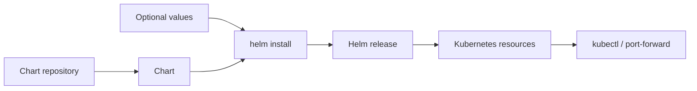

# Helm Workshop

This folder contains notes for installing community Helm charts for NGINX, Grafana, Elasticsearch, and Jenkins.

## Folder Structure

```text
Helm/
├── Nginx.MD
├── Grafana.MD
├── ELK.MD
├── Jenkins.MD
└── README.md
```

## Technical Overview

Helm packages Kubernetes resources as charts and tracks installations as releases. The files in this folder use public chart repositories and mostly rely on chart defaults.



This diagram maps the chart notes in this folder to Helm repositories, releases, and generated Kubernetes resources.

## What Is in the Manifests and Notes

There are no local YAML manifests in this folder. Each Markdown file documents a chart source, install command, access configuration, checks, and uninstall command:

- `Nginx.MD`: Bitnami NGINX.
- `Grafana.MD`: Grafana with port-forwarding and generated admin password.
- `ELK.MD`: Elastic Elasticsearch.
- `Jenkins.MD`: Jenkins with port-forwarding and generated admin password.

## How to Use - Step by Step

### Step 1: Register chart repositories

```bash
helm repo add bitnami https://charts.bitnami.com/bitnami
helm repo add grafana https://grafana.github.io/helm-charts
helm repo add elastic https://helm.elastic.co
helm repo add jenkins https://charts.jenkins.io
helm repo update
```

### Step 2: Install and inspect a release

```bash
helm install simplenginx bitnami/nginx
helm list
kubectl get pods,svc
```

### Step 3: Remove the release

```bash
helm uninstall simplenginx
```

Follow the individual notes for Grafana, Elasticsearch, and Jenkins release names and access commands.

## Use Cases

- Install standard services quickly.
- Learn Helm release lifecycle and chart repositories.
- Test monitoring, search, and CI tools locally.

## Limitations

The examples use the `default` namespace, mutable chart versions, and default resource settings. Pin chart versions, provide values files, configure persistence, and use dedicated namespaces for production.

## Troubleshooting

```bash
helm status <release>
helm get values <release>
helm list --all-namespaces
kubectl get events --sort-by=.lastTimestamp
```

See the detailed guide in [`docs/03-helm.md`](../docs/03-helm.md).
