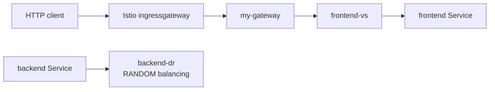

# Istio Workshop

This folder demonstrates an Istio ingress path and a backend traffic policy for a small frontend/backend example.

## Folder Structure

```text
Istio/
├── backend.yaml
├── frontend.yaml
├── istio-gateway.yaml
├── istio-virtualservice.yaml
├── istio-destinationrule.yaml
├── Istio2/README.md
└── README.md
```

## Technical Overview

The Gateway accepts HTTP traffic through the Istio ingress gateway. The VirtualService routes it to `frontend`. The DestinationRule configures randomized load balancing for `backend`.



This diagram maps the workload and Istio YAML files in this folder to the ingress and service-mesh request path.

## What Is in the Manifests

- `backend.yaml` and `frontend.yaml`: Services plus placeholder nginx Deployments.
- `istio-gateway.yaml`: wildcard HTTP Gateway on port `80`.
- `istio-virtualservice.yaml`: route from the Gateway to `frontend`.
- `istio-destinationrule.yaml`: random load balancing for `backend`.
- `Istio2/README.md`: installation and port-forward notes.

## How to Use - Step by Step

### Step 1: Install Istio and enable injection

```bash
istioctl install --set profile=demo -y
kubectl label namespace default istio-injection=enabled
```

### Step 2: Apply workloads and mesh resources

```bash
kubectl apply -f Istio/backend.yaml
kubectl apply -f Istio/frontend.yaml
kubectl apply -f Istio/istio-gateway.yaml
kubectl apply -f Istio/istio-virtualservice.yaml
kubectl apply -f Istio/istio-destinationrule.yaml
```

### Step 3: Test ingress

```bash
kubectl port-forward -n istio-system svc/istio-ingressgateway 8080:80
```

Test with `curl http://localhost:8080`.

## Use Cases

- Introduce service-mesh ingress and routing.
- Separate traffic policy from application Deployments.
- Prepare a workload for observability, security, and progressive delivery.

## Limitations

The workloads are nginx placeholders, wildcard hosts are used, the API version is legacy for newer Istio releases, and the current route does not connect frontend traffic to backend traffic. The demo profile may be heavy for a small cluster.

## Troubleshooting

```bash
istioctl analyze
kubectl get pods -n istio-system
kubectl get gateway,virtualservice,destinationrule
kubectl describe virtualservice frontend-vs
```

See [`docs/07-istio.md`](../docs/07-istio.md) and [`Istio2/README.md`](Istio2/README.md).
