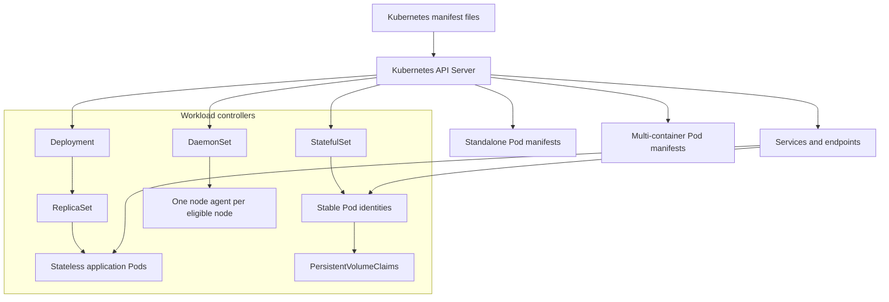

# Kubernetes Workshop ☸️

This folder contains standalone workload manifests and `kubectl` exercises for Kubernetes fundamentals.

## Folder Structure 📁

```text
Kubernetes/
├── Pod_Single.yaml
├── Pod_Multi.yaml
├── Pod_Multi2.yaml
├── Deployment.yaml
├── ReplicaSet.yaml
├── StatefulSet.yaml
├── DaemonSet.yaml
├── SwaggerUI.yml
├── GCP_container.yml
├── README.md
└── README_GCP.md
```

## Folder Architecture 🏗️



## What Is in the Manifests 📦

- `Pod_*.yaml`: single- and multi-container Pod examples.
- `Deployment.yaml`: a stateless Deployment managed through a ReplicaSet.
- `ReplicaSet.yaml`: direct replica reconciliation.
- `StatefulSet.yaml`: stable Pod identities, a headless Service, and storage claims.
- `DaemonSet.yaml`: a node-level logging agent example.
- `SwaggerUI.yml`: an additional application manifest example.
- `GCP_container.yml` and `README_GCP.md`: GKE-oriented access and deployment notes.

## How to Use - Step by Step ▶️

### Step 1: Check the cluster 🔍

```bash
kubectl config current-context
kubectl get nodes
kubectl get pods --all-namespaces
```

### Step 2: Apply a stateless workload 🚀

Run these commands from the repository root:

```bash
kubectl apply -f Kubernetes/Deployment.yaml
kubectl get deployment nginx-deployment
kubectl rollout status deployment/nginx-deployment
kubectl get pods -l app=nginx
```

### Step 3: Inspect the workload 🧭

```bash
kubectl describe deployment nginx-deployment
kubectl logs <pod-name>
kubectl get events --sort-by=.lastTimestamp
```

### Step 4: Remove the example 🧹

```bash
kubectl delete -f Kubernetes/Deployment.yaml
```

Apply the StatefulSet, DaemonSet, or Pod examples separately in a training namespace after reviewing their storage and host-access requirements.

## Use Cases 💡

- Learn the difference between Pods and workload controllers.
- Demonstrate stateless rolling updates with Deployments.
- Demonstrate stable identity and storage with StatefulSets.
- Install node-level agents with DaemonSets.
- Practice the Kubernetes inspection and debugging workflow.

## Limitations ⚠️

- Several manifests use mutable image tags such as `latest`.
- Persistent storage requires a StorageClass available in the target cluster.
- Node agents may require host paths, tolerations, and elevated permissions.
- Standalone Pods are not self-healing after deletion.
- `kubectl apply` changes the active cluster, so use a dedicated namespace for training.

## Troubleshooting 🛠️

```bash
kubectl get events --sort-by=.lastTimestamp
kubectl describe pod <pod-name>
kubectl logs <pod-name>
kubectl get pvc
```

If a StatefulSet remains pending, inspect available StorageClasses. If a DaemonSet is missing from a node, inspect node taints and the DaemonSet tolerations.

See the technology guide in [`docs/02-kubernetes.md`](../docs/02-kubernetes.md) and the GKE notes in [`README_GCP.md`](README_GCP.md).
