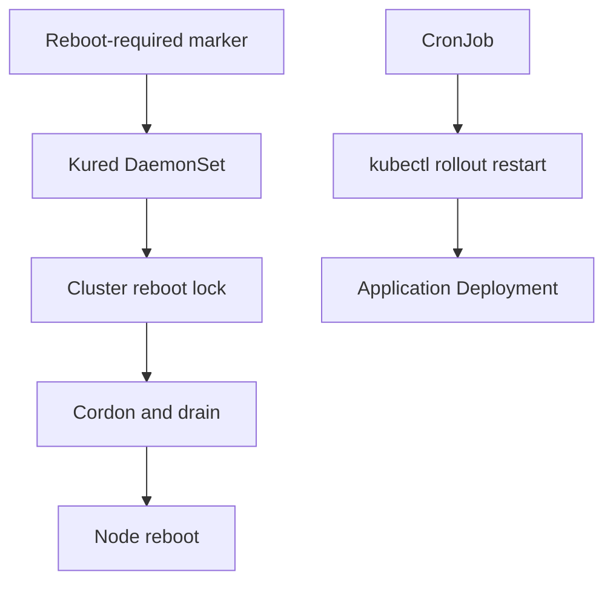

# Kured Workshop

This folder demonstrates coordinated node reboots with Kured and a separate scheduled rollout restart example.

## Folder Structure

```text
Kured/
├── kured.yaml
├── CronJob.yaml
└── README.md
```

## Technical Overview

Kured runs as a privileged DaemonSet and coordinates reboots when nodes require them. The CronJob is a separate educational example that attempts to restart an application deployment on a schedule.



This diagram maps `kured.yaml` to node reboot coordination and `CronJob.yaml` to an application rollout restart.

## What Is in the Manifests

- `kured.yaml`: Kured in `kube-system`, privileged mode, `/var/run` host mount, daily midnight reboot window.
- `CronJob.yaml`: midnight `app1` restart example. It uses a legacy API version and lacks production RBAC.

## How to Use - Step by Step

### Step 1: Install the upstream release

```bash
latest=$(curl -s https://api.github.com/repos/kubereboot/kured/releases | jq -r '.[0].tag_name')
kubectl apply -f "https://github.com/kubereboot/kured/releases/download/$latest/kured-$latest-dockerhub.yaml"
```

### Step 2: Inspect Kured

```bash
kubectl get daemonset,pods -n kube-system -l app=kured
kubectl logs -n kube-system -l app=kured
```

### Step 3: Review and apply the repository example

Review `kured.yaml` schedule and privileges before applying it:

```bash
kubectl apply -f Kured/kured.yaml
```

## Use Cases

- Coordinate maintenance reboots without rebooting every node simultaneously.
- Demonstrate scheduled workload restarts.

## Limitations

Kured is privileged and can disrupt workloads. The repository schedule reboots every day at midnight, `CronJob.yaml` uses deprecated `batch/v1beta1`, and the CronJob has no explicit RBAC. Treat these files as training examples.

## Troubleshooting

```bash
kubectl describe daemonset kured -n kube-system
kubectl get events -n kube-system --sort-by=.lastTimestamp
kubectl get nodes
```

See [`docs/04-kured.md`](../docs/04-kured.md) for the complete operational notes.
