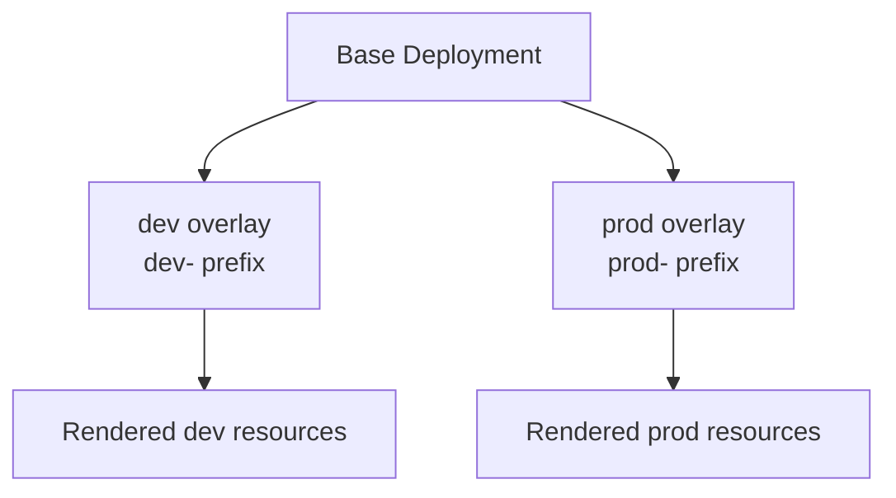

# Kustomize Workshop

This folder demonstrates a shared Kubernetes base with development and production overlays.

## Folder Structure

```text
Kustomize/
├── base/
│   ├── deployment.yaml
│   └── kustomization.yaml
├── overlays/
│   ├── dev/
│   │   ├── kustomization.yaml
│   │   └── replica-count.yaml
│   └── prod/
│       ├── kustomization.yaml
│       └── replica-count.yaml
└── README.md
```

## Technical Overview

The base contains `example-app`. Each overlay reuses it, adds a name prefix, and applies an environment-specific replica patch.



This diagram maps the base and overlay files in this folder to the rendered dev and prod resources.

## What Is in the Manifests

- `base/deployment.yaml`: nginx Deployment named `example-app`.
- `base/kustomization.yaml`: base resource list.
- `overlays/dev` and `overlays/prod`: prefixes and replica-count patches.

## How to Use - Step by Step

### Step 1: Preview both overlays

```bash
kubectl kustomize Kustomize/overlays/dev
kubectl kustomize Kustomize/overlays/prod
```

### Step 2: Apply one environment

```bash
kubectl apply -k Kustomize/overlays/dev
kubectl get deployment
```

### Step 3: Remove the environment

```bash
kubectl delete -k Kustomize/overlays/dev
```

## Use Cases

- Reuse common manifests across environments.
- Change replicas or names without copying the base.
- Review rendered YAML in CI before deployment.

## Limitations

The overlays do not define namespaces, Services, or health probes. Applying both to one cluster can create confusing parallel workloads. The manifests use the older `patchesStrategicMerge` field and mutable nginx tags.

## Troubleshooting

```bash
kubectl diff -k Kustomize/overlays/dev
kubectl get deployment dev-example-app -o yaml
```

See [`docs/05-kustomize.md`](../docs/05-kustomize.md).
