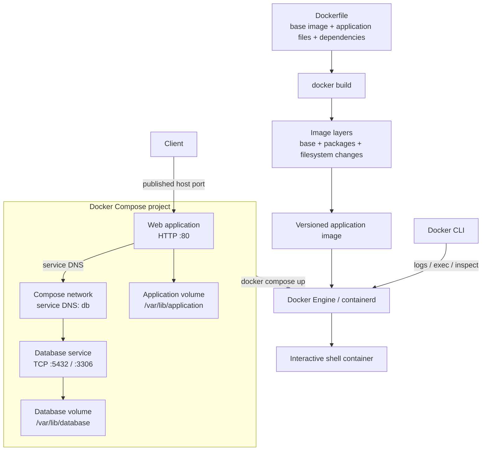

# 01 - Docker 🐳

## Scope 🎯

Docker packages an application and its runtime dependencies into an image that can run consistently on a laptop, CI worker, or server. It separates image creation from container execution and supports multi-container application networks through Compose.

## Core Concepts 🧱

```text
Dockerfile -> image -> container
Compose file -> services + network + volumes
```

An image is an immutable build artifact. A container is a running process with isolated filesystem, network, and resource settings. Compose adds service discovery, dependency declarations, and persistent volumes for local application stacks.

## Technical Architecture 🏗️



## Technical Building Blocks 🔩

- A Dockerfile defines a reproducible image build.
- Image layers are cached and reused between builds.
- Containers are disposable runtime instances of images.
- Compose models a local application as communicating services.
- Volumes persist state outside a container lifecycle.

## How to Use ▶️

Build and inspect an image:

```bash
docker build -t my-app:dev .
docker image ls my-app
docker run --rm -it my-app:dev
```

Start a Compose application:

```bash
docker compose up -d
docker compose ps
```

Inspect logs and stop the application with:

```bash
docker compose logs -f <service>
docker compose down
```

Use `docker compose down -v` only when you intentionally want to remove persistent volumes.

## Use Cases 💡

- Learning image layers and container lifecycle commands.
- Running repeatable local development environments.
- Testing application-to-database connectivity through Compose service DNS.
- Building a portable image for a web application.

## Constraints and Risks ⚠️

- Mutable or old image tags reduce reproducibility; pin versions.
- Passwords are stored directly in Compose YAML for training only.
- Publishing port `80` and using `LoadBalancer`-style exposure locally may conflict with existing services.
- The `platform: linux/x86_64` setting may require emulation on Apple Silicon.
- Named volumes persist data beyond container removal; this is useful but can surprise cleanup workflows.

## Troubleshooting 🛠️

```bash
docker compose logs -f <service>
docker compose ps
docker inspect <container>
```

If a service cannot connect to another service, verify the Compose network, service DNS name, credentials, and ports. If a host port is busy, change only the host-side port mapping.
