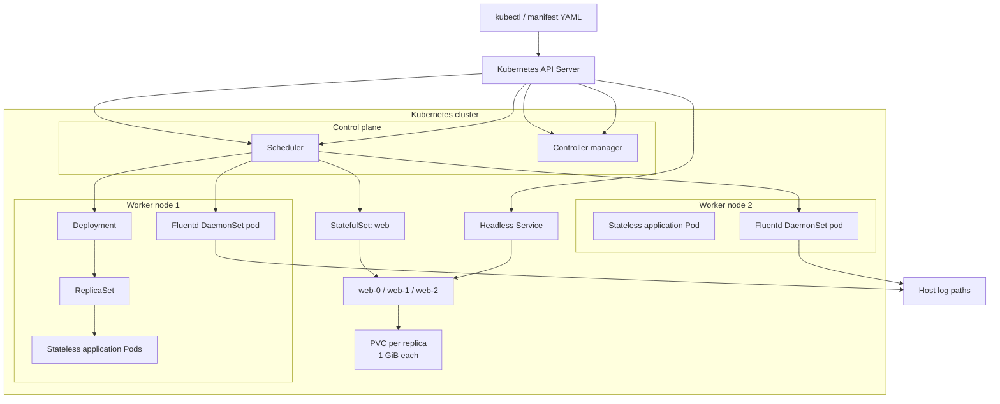

# 02 - Kubernetes ☸️

## Scope 🎯

Kubernetes is a declarative orchestration platform. It schedules containers, continuously reconciles desired state, provides service discovery, and offers controller abstractions for stateless, stateful, and node-local workloads.

## Core Concepts 🧱

```text
Pod -> controller -> Service -> client
Deployment -> ReplicaSet -> stateless Pods
StatefulSet -> stable identities + persistent storage
DaemonSet -> one Pod on each eligible node
```

The API server stores desired objects. Controllers compare desired and observed state, the scheduler assigns Pods to nodes, and kubelet starts containers on those nodes.

## Technical Architecture 🏗️



## Technical Building Blocks 🔩

- Pods are the smallest schedulable unit and can contain multiple tightly coupled containers.
- Deployments provide rolling updates and rollback through ReplicaSets.
- StatefulSets provide stable names, ordering, and storage claims.
- DaemonSets deploy node-scoped agents such as log collectors.
- Services provide stable virtual endpoints over changing Pod IPs.

## How to Use ▶️

Check the active cluster and inspect existing workloads:

```bash
kubectl config current-context
kubectl get nodes
kubectl get pods -A
```

Apply an individual example:

```bash
kubectl apply -f deployment.yaml
kubectl get deployment <deployment-name>
kubectl rollout status deployment/<deployment-name>
```

Inspect and remove it:

```bash
kubectl describe deployment <deployment-name>
kubectl delete -f deployment.yaml
```

For the StatefulSet, verify both stable names and storage requests:

```bash
kubectl apply -f <statefulset-manifest.yaml>
kubectl get statefulset,pods,pvc
```

## Use Cases 💡

- Teaching the difference between Pods and controllers.
- Demonstrating stateless rolling updates with Deployments.
- Demonstrating stable identity and storage with StatefulSets.
- Installing node-level logging agents with DaemonSets.
- Practicing the Kubernetes inspection and debugging workflow.

## Constraints and Risks ⚠️

- Mutable image tags such as `latest` reduce reproducibility.
- Persistent storage requires a StorageClass that exists in the target cluster.
- Node agents may require host paths, tolerations, and elevated permissions.
- Standalone Pods are not self-healing after deletion.
- `kubectl apply` changes the active cluster, so use a dedicated namespace for training.

## Troubleshooting 🛠️

```bash
kubectl get events --sort-by=.lastTimestamp
kubectl describe pod <pod-name>
kubectl logs <pod-name>
kubectl get pvc
```

If a StatefulSet remains pending, inspect StorageClasses and configure one available in the target cluster. If a DaemonSet is missing from control-plane nodes, inspect its tolerations and node taints.
