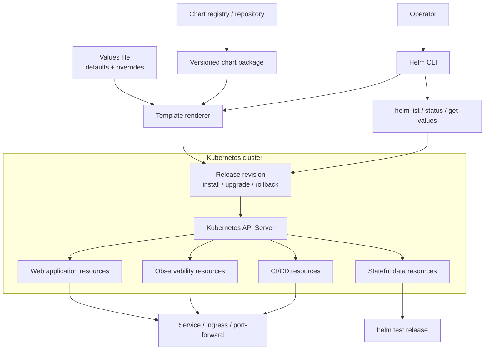

# 03 - Helm ⎈

## Scope 🎯

Helm is a package manager and release manager for Kubernetes. A chart combines templates, defaults, metadata, and dependencies; Helm renders those templates into Kubernetes objects and stores release history for upgrades and rollback.

## Core Concepts 🧱

```text
Chart repository -> chart version -> rendered manifests -> release
Values -> templates -> Kubernetes API
Release history -> upgrade / rollback
```

Charts package reusable Kubernetes application patterns, while values provide controlled configuration without editing chart templates.

## Technical Architecture 🏗️



## Technical Building Blocks 🔩

- Charts package reusable Kubernetes application patterns.
- Values override defaults without editing templates.
- Releases track deployed revisions in the target namespace.
- Hooks and tests can validate or prepare a release.
- `helm template` renders output without changing a cluster.

## Generic Workflow ▶️

### Step 1: Register a chart repository 📦

```bash
helm repo add <repository-name> <repository-url>
helm repo update
```

### Step 2: Inspect and render a chart 🔍

```bash
helm show values <repository>/<chart>
helm template <release-name> <repository>/<chart> --namespace <namespace>
```

### Step 3: Install and manage a release 🔁

```bash
helm install <release-name> <repository>/<chart> --namespace <namespace> --create-namespace
helm upgrade <release-name> <repository>/<chart> --namespace <namespace>
helm rollback <release-name> <revision> --namespace <namespace>
helm uninstall <release-name> --namespace <namespace>
```

## Use Cases 💡

- Installing standard platform services quickly.
- Comparing chart defaults with customized values.
- Managing releases with revisions, upgrades, and rollback history.
- Packaging an internal application for repeatable deployment.

## Limitations ⚠️

- Unpinned chart versions can produce different manifests over time.
- Values can expose credentials or unsafe defaults if not reviewed.
- Helm does not replace Kubernetes runtime policies, backups, or security controls.
- Stateful charts require deliberate storage, upgrade, and recovery planning.

## Troubleshooting 🛠️

```bash
helm status <release> --namespace <namespace>
helm get values <release> --namespace <namespace>
helm list --all-namespaces
kubectl get events --sort-by=.lastTimestamp
```

Use `helm template` and `helm diff` before changing a release. Inspect rendered manifests, hooks, and Pod events when an upgrade is stuck.
