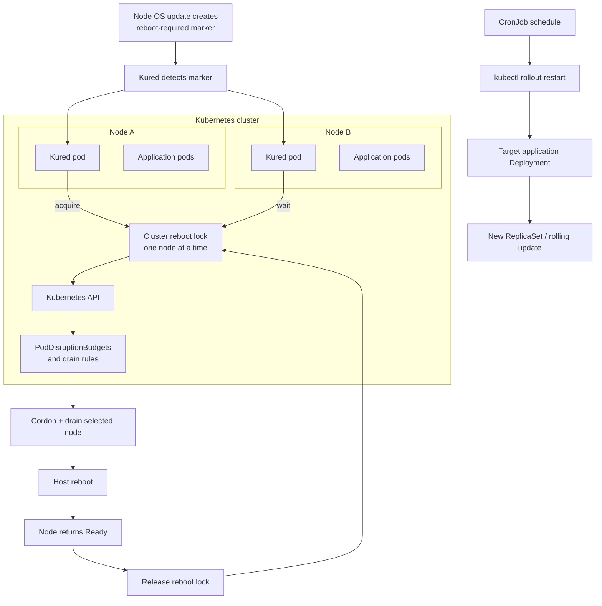

# 04 - Kured 🔄

## Scope 🎯

Kured (Kubernetes Reboot Daemon) coordinates safe node reboots after operating-system updates. It runs as a DaemonSet, uses a cluster-wide lock, and performs cordon, drain, and reboot operations so multiple nodes are not restarted simultaneously.

## Core Concepts 🧱

```text
Update marker -> Kured agent -> reboot lock -> cordon/drain -> reboot -> Ready
Scheduled CronJob -> application rollout restart
```

Kured coordinates node maintenance; it does not replace application deployment controllers or PodDisruptionBudgets.

## Technical Architecture 🏗️



## Technical Building Blocks 🔩

- Kured agents watch for reboot-required signals on their node.
- A distributed lock prevents concurrent disruptive reboots.
- Cordon and drain protect workloads during node maintenance.
- PodDisruptionBudgets and readiness determine whether draining can proceed.
- A CronJob restart is an application-level operation separate from node reboot coordination.

## Generic Workflow ▶️

### Step 1: Install Kured 📦

```bash
latest=<latest-supported-version>
kubectl apply -f <kured-release-manifest-url>-$latest.yaml
```

### Step 2: Inspect the controller 🔍

```bash
kubectl get daemonset,pods -n kube-system -l app=kured
kubectl logs -n kube-system -l app=kured
```

### Step 3: Verify maintenance safety 🛡️

```bash
kubectl get nodes
kubectl get poddisruptionbudgets --all-namespaces
kubectl get events -n kube-system --sort-by=.lastTimestamp
```

## Use Cases 💡

- Coordinate maintenance reboots without rebooting every node simultaneously.
- Protect workloads during operating-system maintenance windows.
- Trigger controlled application rollouts separately from node maintenance.

## Limitations ⚠️

- Kured requires privileged access and host-level mounts.
- Reboots can still disrupt workloads if replicas, probes, or budgets are incorrect.
- Daily reboot schedules are not a safe production default.
- Automated maintenance requires monitoring, change control, and rollback planning.

## Troubleshooting 🛠️

```bash
kubectl describe daemonset <kured-daemonset> -n kube-system
kubectl get events -n kube-system --sort-by=.lastTimestamp
kubectl get nodes
kubectl get lease -A
```

Inspect permissions, host mounts, taints, drain failures, and PodDisruptionBudgets when a node cannot be rebooted safely.
