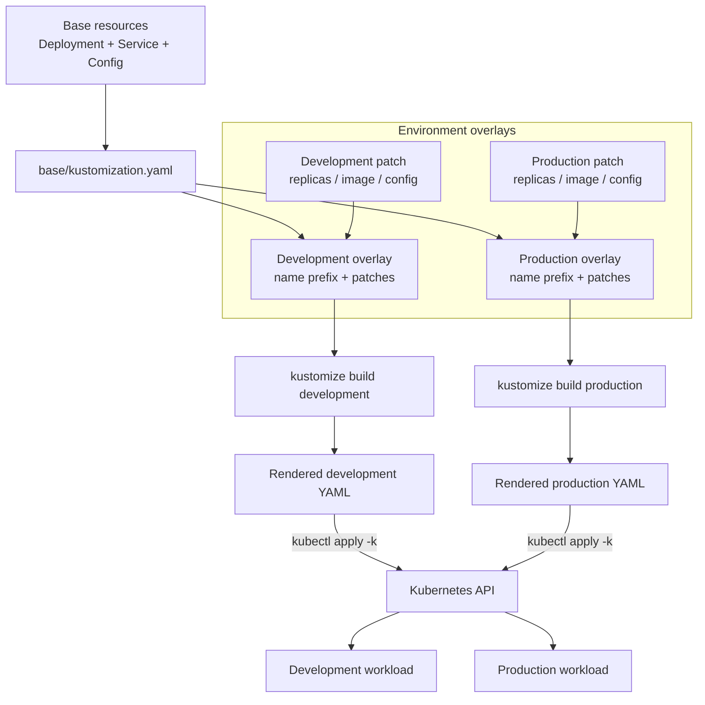

# 05 - Kustomize 🧩

## Scope 🎯

Kustomize is a Kubernetes-native configuration transformer. It composes bases and overlays, applies patches, changes names or namespaces, and renders plain Kubernetes YAML without introducing a general-purpose template language.

## Core Concepts 🧱

```text
Base resources + overlay patches -> rendered environment
namePrefix / namespace / images / replicas -> transformed YAML
```

An overlay composes a base and changes only the fields that differ between environments.

## Technical Architecture 🏗️



## Technical Building Blocks 🔩

- A base contains reusable, environment-neutral resources.
- An overlay applies environment-specific changes.
- Name prefixes and namespaces prevent collisions between environments.
- Patches modify selected fields while preserving the shared base.
- Rendering can be checked in CI before applying to a cluster.

## Generic Workflow ▶️

### Step 1: Render an overlay 🧱

```bash
kubectl kustomize overlays/<environment>
```

### Step 2: Review the difference 🔍

```bash
kubectl diff -k overlays/<environment>
```

### Step 3: Apply or remove the overlay ▶️

```bash
kubectl apply -k overlays/<environment>
kubectl delete -k overlays/<environment>
```

## Use Cases 💡

- Reuse common manifests across environments.
- Change replicas, names, images, or configuration without copying the base.
- Review rendered YAML in CI before deployment.

## Limitations ⚠️

- Patch behavior depends on resource identity and field structure.
- Applying multiple overlays to one namespace can create collisions.
- Kustomize does not provision external dependencies or replace policy checks.
- Large overlay trees can become difficult to trace without rendered output.

## Troubleshooting 🛠️

```bash
kubectl kustomize overlays/<environment> > /tmp/rendered.yaml
kubectl diff -k overlays/<environment>
kubectl get deployment <deployment-name> -o yaml
```

If a patch does not apply, inspect rendered output and verify the target resource kind, name, namespace, and API version.
