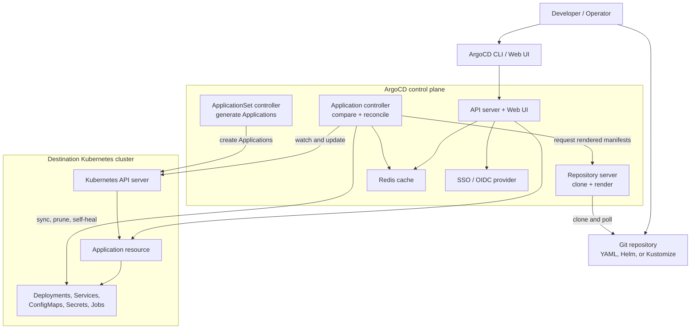

# 06 - ArgoCD 🚀

## Scope 🎯

ArgoCD is a declarative GitOps continuous delivery controller for Kubernetes. Git stores the desired state, ArgoCD renders and compares manifests, and the application controller reconciles the cluster until live state matches Git.

## Core Concepts 🧱

```text
Git repository -> Application -> rendered manifests -> Kubernetes cluster
Desired state vs live state -> sync, prune, self-heal
Web UI / CLI -> API server -> repository server and controller
```

An ArgoCD `Application` binds a source repository and path to a destination cluster and namespace. Synchronization can be automatic or initiated by an operator.

## Technical Architecture 🏗️



## Technical Building Blocks 🔩

- Applications define source, destination, project, and synchronization policy.
- Repository servers render plain YAML, Helm charts, or Kustomize overlays.
- The application controller compares desired and live state.
- Automated sync can prune removed resources and self-heal drift.
- Projects provide grouping and access boundaries.
- Redis caches repository and comparison data; SSO integrates external identity.

## Generic Workflow ▶️

### Step 1: Install ArgoCD 📦

```bash
kubectl create namespace argocd
kubectl apply -n argocd -f <argocd-install-manifest-url>
kubectl get pods -n argocd
```

### Step 2: Define an Application 📝

```yaml
apiVersion: argoproj.io/v1alpha1
kind: Application
metadata:
  name: <application-name>
  namespace: argocd
spec:
  source:
    repoURL: <git-repository>
    path: <manifest-path>
    targetRevision: <branch-or-tag>
  destination:
    server: https://kubernetes.default.svc
    namespace: <target-namespace>
```

### Step 3: Apply and observe reconciliation 🔄

```bash
kubectl apply -f application.yaml
kubectl get applications -n argocd
kubectl describe application <application-name> -n argocd
```

## Use Cases 💡

- Git-driven Kubernetes delivery and rollback.
- Automated drift correction and self-healing.
- Progressive delivery across multiple clusters or namespaces.
- Centralized application visibility and deployment history.

## Limitations ⚠️

- Git is only as reliable as its review, branch, and access controls.
- Automated pruning can delete resources removed from Git.
- Secrets require external secret management or encryption; plain Git YAML is unsafe.
- Large repositories and frequent polling can increase controller and repository-server load.
- Health status depends on resource-specific health checks and correct readiness probes.

## Troubleshooting 🛠️

```bash
kubectl get applications -n argocd
kubectl get events -n argocd --sort-by=.lastTimestamp
kubectl logs deployment/argocd-application-controller -n argocd
kubectl logs deployment/argocd-repo-server -n argocd
```

For `OutOfSync`, compare rendered manifests with live resources. For `Progressing`, inspect health probes and controller events. For `ComparisonError`, verify repository access, manifest rendering, and repository-server health.
