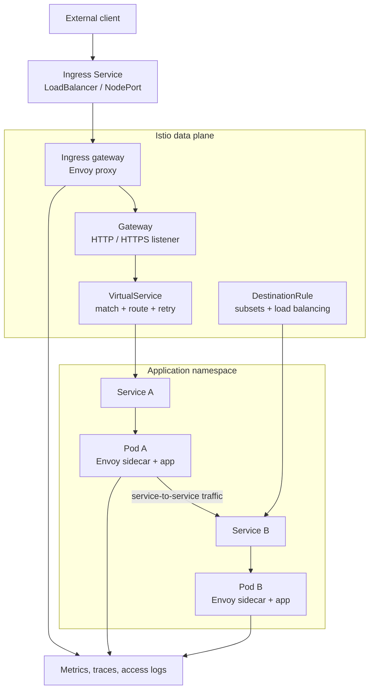

# 07 - Istio 🕸️

## Scope 🎯

Istio is a service mesh that adds traffic management, security, and observability around services through a control plane and data-plane proxies. Applications can gain routing, retries, telemetry, and policy without embedding all networking behavior in application code.

## Core Concepts 🧱

```text
Control plane -> configuration -> Envoy sidecars / gateways
Client -> ingress gateway -> routing rules -> service -> sidecar -> workload
```

The control plane distributes validated configuration; the data plane handles application traffic, policy enforcement, and telemetry.

## Technical Architecture 🏗️



## Technical Building Blocks 🔩

- Gateways define ingress or egress listeners.
- VirtualServices define host, path, weight, retry, and timeout routing behavior.
- DestinationRules define subsets, connection policies, and load balancing.
- Sidecar proxies intercept service traffic and export telemetry.
- The control plane validates and distributes configuration to the data plane.
- mTLS and authorization policies can protect service-to-service communication.

## Generic Workflow ▶️

### Step 1: Install the control plane 📦

```bash
istioctl install --set profile=<profile> -y
kubectl get pods -n istio-system
```

### Step 2: Enable sidecar injection 🧬

```bash
kubectl label namespace <application-namespace> istio-injection=enabled
kubectl rollout restart deployment <deployment-name> -n <application-namespace>
```

### Step 3: Apply mesh configuration and test ingress 🌐

```bash
kubectl apply -f gateway.yaml
kubectl apply -f virtual-service.yaml
kubectl apply -f destination-rule.yaml
kubectl port-forward -n istio-system svc/<ingress-service> 8080:80
curl http://localhost:8080
```

## Use Cases 💡

- Centralized ingress and service-to-service routing.
- Canary, weighted, and header-based traffic management.
- mTLS, authorization policies, and workload identity.
- Consistent telemetry, retries, timeouts, and circuit breaking.

## Limitations ⚠️

- Sidecars increase CPU, memory, startup time, and operational complexity.
- Misconfigured routes or policies can block otherwise healthy applications.
- The control plane and ingress gateway become additional platform components to operate.
- Mesh telemetry and mTLS require careful sampling, certificate, and policy management.
- A service mesh does not replace application-level authentication or resilient business logic.

## Troubleshooting 🛠️

```bash
istioctl analyze -A
kubectl get pods -n istio-system
kubectl get gateway,virtualservice,destinationrule -A
kubectl describe virtualservice <name> -n <namespace>
kubectl logs <pod> -c istio-proxy -n <namespace>
```

If routes fail, verify Gateway selectors, host names, service ports, sidecar injection, and ready endpoints. If sidecars are missing, recreate Pods after labeling the namespace.
